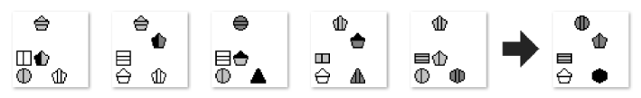

# Diagrammatic Reasoning

Code for my Bachelor's thesis on solving Diagrammatic Abstract Reasoning tests with deep learning. The thesis is available [here](https://drive.google.com/file/d/1icwNLuWcV3oxdftPHFDEc4bP05zI7Ff9/view) (in german). An example for a diagrammatic reasoning test is given below. The tests used in my thesis are loosely based on commonly used IQ tests. It is apparent, how the abstract symbols in the sequence of five images on the left are changing according to some pattern. The task consists of finding this pattern and generating the consequent sixth image according to this pattern.  

## Setup
    pip install -r requirements.txt
## Diagrammatic Abstract Reasoning Test Generation
This repo contains an algorithm for the construction of diagrammatic reasoning tests. To generate, e.g., 1000 samples, execute:  

    cd generator 
    python main_gen.py --savepath path/for/saving --n_seqs 1000

## Training and Testing a Model

The CNNRNN, CNNConvLSTM and FullyCNN described in the thesis are available in this repo. A simple train and test run, for example for the CNNConvLSTM, can be executed by  
    
    cd models 
    python CNNConvLSTM.py --dataset_path ..\dataset --model_path model_test_path --model_name model_test_name --epochs 15

## RelNet Implementation

A custom Keras implementation of a RelNet (Santoro et al.: A simple neural network module for relational reasoning,
    NeurIPS 2017) is provided in [models/RelNet.py](models/RelNet.py).